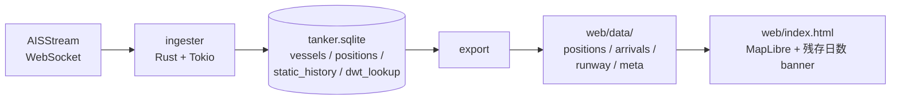

# tanker-watch-jp

日本向け原油タンカーの動きを公開 AIS データだけで追跡し、政府発表の「総量は足りている」を独立に検証可能な数字に変換するオープンソースプロジェクト。



## 何ができるか

- **Hormuz / Malacca / 日本接近**の3つの bbox を AIS WebSocket で購読し、ship_type 80–89 (タンカー) を抽出。
- 各タンカーの **LOA × beam** から `α: DWT ≈ 0.046·LOA²·beam` で deadweight を推定。VLCC / Suezmax / Aframax / MR2 で ±15%。
- AIS captain-reported draught と推定 DWT から**現積載量 (crude bbl)** を換算。
- destination 文字列 (`JP MIZ`, `>JP YAT OFF`, `JPCHB` 等) を**日本主要原油港 14 箇所**にマッチ、入港予定キューを生成。
- 残存日数 = (備蓄 240日 + 捕捉中タンカー積載合計) ÷ METI 公表日次消費 2.8M bbl/d。
- 全部静的 JSON にエクスポート → MapLibre 地図 + サイドパネルで可視化。

## 試算例 (実捕捉船)

| 船 | LOA × beam | 喫水 | α DWT | 推定積載 | 仕向地 |
|---|---|---|---|---|---|
| ENEOS OCEAN | 340 × 60 (VLCC) | 15.3m | 319,000t | ~1.16M bbl crude (50%) | 水島 |
| MARAN POSEIDON | 270 × 48 (Suezmax) | — | 161,000t | — | — |
| GINGA LEOPARD | 250 × 44 (Aframax) | 6.6m | 126,500t | ~0 (空荷) | ULSAN |

## ローカルで動かす

```bash
# 1. AISStream.io 無料 API key 発行 → .env
echo "AISSTREAM_API_KEY=xxx" > .env

# 2. ingester を走らせる (Ctrl+C で停止、再起動で続き)
set -a && source .env && set +a
cargo run --release --bin tanker-watch-jp

# 3. 別ターミナルでスナップショット
cargo run --release --bin export

# 4. CLI で港キュー確認
cargo run --release --bin queue

# 5. ブラウザでフロントエンド
cd web && python3 -m http.server 8000
# → http://localhost:8000
```

## アーキテクチャ

```mermaid
erDiagram
    vessels ||--o{ positions : mmsi
    vessels ||--o{ static_history : mmsi
    vessels {
        INTEGER mmsi PK
        INTEGER imo
        TEXT name
        INTEGER ship_type "80-89=tanker"
        INTEGER dim_a "bow"
        INTEGER dim_b "stern"
        INTEGER dim_c "port"
        INTEGER dim_d "starboard"
    }
    positions {
        INTEGER mmsi PK_FK
        TEXT ts PK
        REAL lat
        REAL lon
        REAL sog "knots"
        REAL heading
    }
    static_history {
        INTEGER mmsi PK_FK
        TEXT ts PK
        REAL draught "key for cargo est"
        TEXT destination
        TEXT eta
    }
    dwt_lookup {
        INTEGER imo PK
        INTEGER dwt
        TEXT source "wikidata/eu_mrv/manual"
    }
```

## スタック

- Rust (tokio, tokio-tungstenite, rusqlite, serde, chrono)
- SQLite (WAL mode)
- MapLibre GL JS (CDN, free demo tiles)
- 静的 JSON 出力 → 任意の静的ホスティング (GitHub Pages / Cloudflare Pages 等)

## 制約・注意

- α DWT は LOA × beam だけからの回帰、商業 IMO→DWT データセット (Kayrros / Vortexa / IHS Markit) より粗い。`dwt_lookup` テーブルに EU MRV 等の bulk データを後で流し込めば精度向上。
- BBox が現状 Hormuz / Malacca / 日本接近の3箇所のみ。喜望峰回り・北極海航路・南米経由は未捕捉。`src/main.rs` で BBox 追加可。
- AIS draught は captain 自己申告。意図的虚偽 (制裁回避目的の AIS spoofing 等) を検知する仕組みは未実装。Day v0.2 以降で SAR (Sentinel-1) 突合を予定。
- 備蓄 240日・消費 2.8M bbl/d は METI / IEA 2025 値の固定定数。e-Stat API での自動更新は未実装。
- ship_type 80-89 は crude / product / chemical / LNG / LPG を区別しない。bbl 表示は **crude-equivalent**。

## License

MIT
